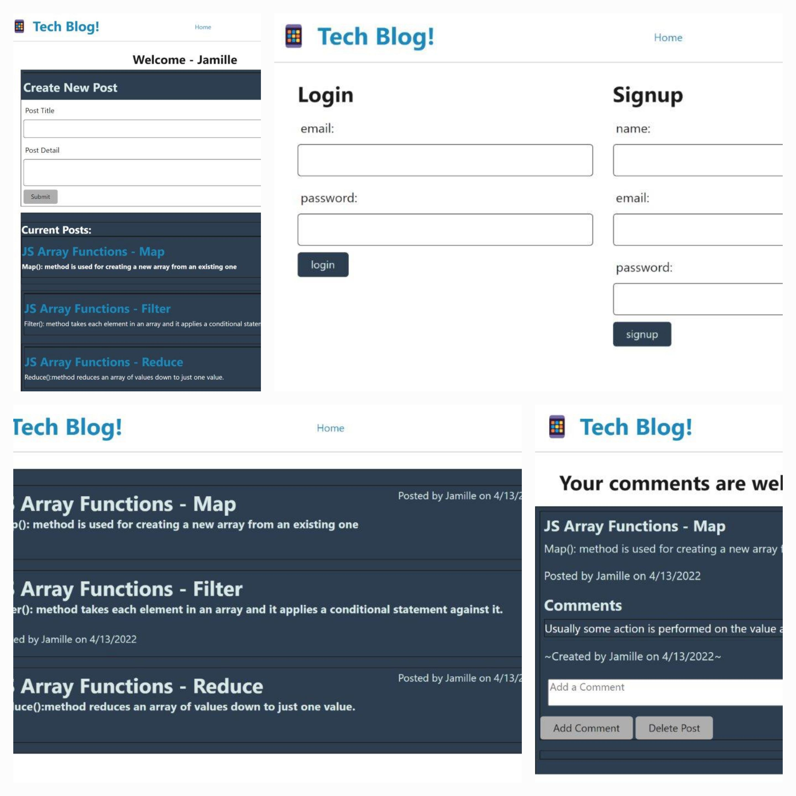

# tech-blog-MVC
A place to for developers to share and discuss technical concepts and recent advancements.

## Description
CMS-style blog site similar to a Wordpress site, where developers can publish their blog posts and comment on other developers’ posts as well.

The site has been built from scratch and deployed to Heroku. It follows the MVC paradigm in its architectural structure, using Handlebars.js 
as the templating language, Sequelize as the ORM, and the express-session npm package for authentication.

## Usage
Use the link to the deployed site on Heroku.
Once the app is launched login or sign-up, then begin sharing your tech knowledge.

## Mockup
A link to the deployed app on Heroku: 'https://tech-blog-launch.herokuapp.com/'

## Contribution Guidelines
Your suggestions and comments are welcome on the tech-blog. 

We use Github and all it's built-in features to host the website, and to pull requests to the local repository.

Report all bugs to Github <a href="https://github.com/issues" target="_blank">issues</a> 

This website uses semantic HTML elements, and universal, element, and class selectors in CSS.

# License
All submissions to this project will fall under <a href="https://choosealicense.com/licenses/mit/" target="_blank">issues</a>
